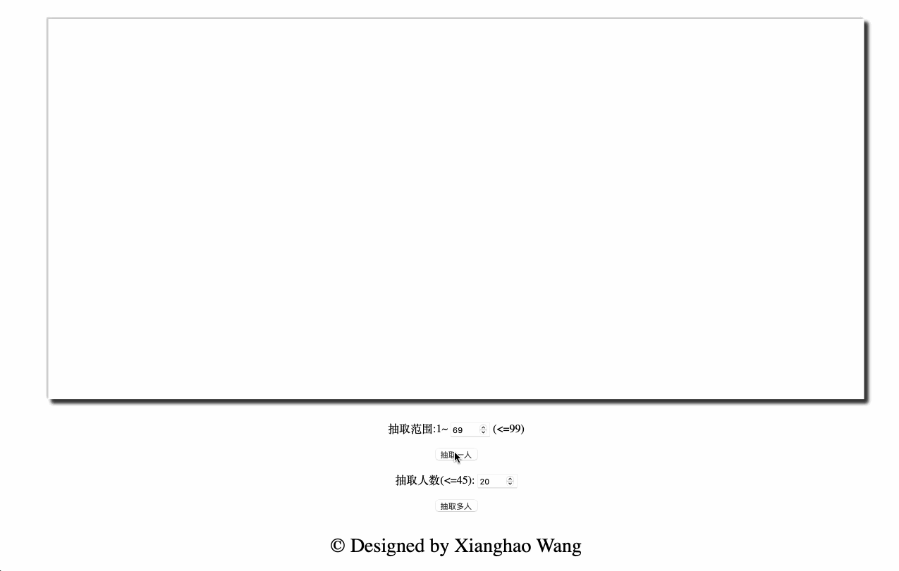

# 点名器

    
    

* 在移动硬盘中考古发现n年前写的点名器😅....动画灵感来源于[liuyubobobo](https://www.imooc.com/u/108955/courses?sort=publish)老师的倒计时器
* 用于抽取学生学号随机回答问题
* 支持单人抽取和多人抽取
* 支持自定义范围
* **代码都糊在一个文件里了，求好心人重构**😅😅😅😅😅

# 演示

# 用法
* **全屏后如发现中间画框大小未改变请刷新**
* 点击**抽取一人**，上面输入框可以调整范围，**不要超过后面提示范围**
* 点击**抽取多人**，上面输入框可以调整抽取的人数，**也不要超过后面的提示范围**，多个结果会显示在下方
* **抽取动画进行时，点击按钮，不会有任何反应**

# 联系方式
* [xianghaowang2001@outlook.com](mailto:xianghaowang2001@outlook.com)
* **QQ**

  

  

